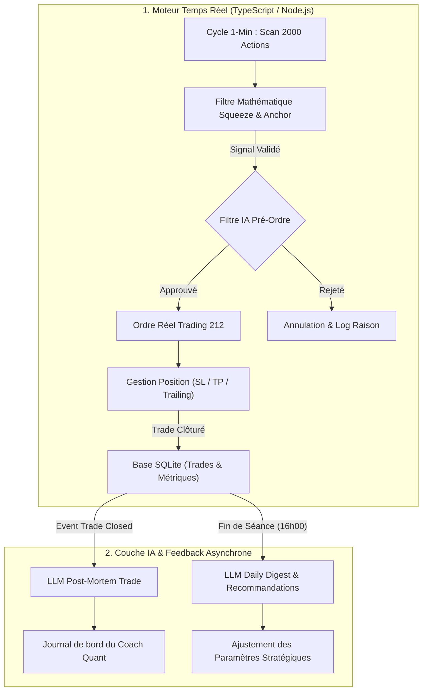

# Intégration de l'IA & Boucles de Feedback dans le Système de Trading John Carter

Ce document définit la stratégie, l'architecture et les templates de prompts pour intégrer des modèles de langage (LLM / IA de raisonnement) au moteur de trading quantitatif intraday.

---

## 1. Vision & Rôles Complémentaires

| Rôle | Moteur Algorithmique (TypeScript) | Modèle d'IA (LLM / Raisonnement) |
| :--- | :--- | :--- |
| **Vitesse** | Milliseconde (temps réel, tick-par-tick) | Asynchrone / Secondes (décisionnel & analyse) |
| **Spécialité** | Mathématiques, calcul d'indicateurs (TTM Squeeze, Keltner, LinReg, ATR) | Analyse de contexte, compréhension des news, détection d'anomalies, feedback adaptatif |
| **Mission** | Détecter et exécuter | Filtrer les pièges qualitatifs et optimiser la stratégie dans le temps |

---

## 2. Pilier 1 : Le Filtre Pré-Ordre ("Second Opinion" Contextuel)

### Principe
Lorsqu'une action est qualifiée par l'algorithme ($Squeeze \text{ Fired} + \text{Anchor } 60m + RVOL \ge 1.20$), une requête rapide (timeout 2s) est envoyée à l'IA avant la transmission de l'ordre à Trading 212.

### Objectif
Éliminer les faux signaux techniques causés par des événements non quantifiables par les maths pures :
- Offres publiques d'achat (OPA) ou rachat d'entreprise (cours bloqué).
- Annonces de dilution d'actions / *Reverse splits*.
- Résultats cliniques FDA binaires imprévisibles.
- Spikes de volume aberrants sur manipulation de carnet.

### Algorithme de Sélection du Feedback Pertinent (RAG Ciblé - Max 3 à 5 Leçons)
Pour ne pas saturer le contexte du prompt et éviter le bruit, le système sélectionne uniquement les retours d'expérience selon une **hiérarchie de 4 critères stricts** :

```text
Ordre de Priorité pour injecter {{recentFeedbackLessons}} :
1. LE MÊME ACTIF (Symbol Match) :
   -> Si TWST a déjà été tradé cette semaine, injecter le résultat exact du dernier trade sur TWST.
2. LE MÊME SECTEUR & PROFIL DE VOLATILITÉ (Sector/Market Cap Match) :
   -> Si Biotech / Micro-Cap : injecter les feedbacks récents sur les biotechs (ex: dilutions).
   -> Si Tech / Mega-Cap : injecter les feedbacks sur les valeurs tech.
3. LA MÊME TRANCHE HORAIRE & RÉGIME DE MARCHÉ (Context Match) :
   -> Si le trade survient à 12h15 : injecter les retours sur la Chop Zone (12h00-13h30).
   -> Si le $ADD est très haussier : injecter les feedbacks sur les marchés en Trend Day.
4. LES 2 DERNIERS ÉCHECS GLOBAUX (Recency Failures) :
   -> Rappeler les 2 dernières erreurs évitables identifiées par le Coach Quant.
```

```text
Tu es un gestionnaire de risque senior spécialisé dans le trading intraday d'actions US (méthodologie John Carter).
Un signal technique d'achat (LONG) vient d'être validé par l'algorithme sur l'action suivante.

DONNÉES DU SETUP TECHNIQUE :
- Symbole : {{symbol}}
- Cours actuel : {{currentPrice}}$
- Heure EST : {{currentTimeEST}}
- TTM Squeeze : {{squeezeState}} (Momentum 5m: {{momentum5m}})
- Anchor 60m : {{anchorTrend}} (Momentum 60m: {{momentum60m}})
- Volume Relatif (RVOL) : {{rvol}}
- Niveaux : SL = {{stopLoss}}$, TP1 = {{takeProfit1}}$ (Ratio R/R : {{riskRewardRatio}}R)
- Contexte Marché : $ADD = {{nyseAdd}}, $TICK = {{nyseTick}}

TITRES DES DERNIÈRES ACTUALITÉS DU JOUR SUR {{symbol}} :
{{recentNewsHeadlines}}

MÉMOIRE DES RETOURS D'EXPÉRIENCE & FEEDBACKS RÉCENTS (Dernières leçons apprises) :
{{recentFeedbackLessons}}
<!-- Exemples injectés dynamiquement :
- "Attention : les trades initiés entre 12h00 et 13h15 ont un taux d'échec de 75% (Chop Zone)."
- "Sur les valeurs biotech à forte hausse, vérifier l'absence d'offre secondaire (dilution d'actions)."
- "Les setups avec Squeeze Fired + RVOL > 2.0 ont un taux de réussite de 85%."
-->

CONSIGNES DE DÉCISION :
1. Confrontation avec le Feedback : Vérifie si ce trade reproduit un schéma d'échec identifié dans la mémoire des feedbacks récents.
2. Risque Qualitatif / News : Évalue si l'action présente un piège (OPA bloquante, dilution imminente, décision binaire).
3. Décision finale : Approuve l'ordre uniquement si le setup est sain et aligné avec l'historique d'apprentissage.

Réponds STRICTEMENT au format JSON valide suivant :
{
  "approve": true, // true pour autoriser l'ordre, false pour l'annuler
  "confidence": 0.95, // note de 0.0 à 1.0
  "riskLevel": "LOW", // "LOW", "MEDIUM", "HIGH"
  "matchedPastFailurePattern": false, // true si ce setup ressemble à un échec passé
  "reason": "Explication synthétique justifiant la décision (en faisant référence au feedback si applicable)."
}
```

---

## 3. Pilier 2 : La Boucle de Feedback Post-Trade (Le "Coach Quant")

### Principe
À chaque clôture de position ou à la fin de la séance (16h00 EST / 22h00 Paris), l'API envoie l'historique chronologique des trades à l'IA.

### Objectif
- Analyser la cause des pertes (Stop trop serré ? Bruit de marché ? Heure de faible liquidité ?).
- Analyser les gains manqués (Le cours est-il monté à $+5\%$ après que le Trailing Stop ait coupé à $+1.5\%$ ?).
- Fournir un rapport d'apprentissage journalier et des recommandations concrètes.

### Template de Prompt Post-Mortem de Trade

```text
Tu es un ingénieur quantitatif et coach de trading expert de la méthode John Carter (« Mastering the Trade »).
Analyse l'exécution de la position suivante qui vient d'être clôturée.

DONNÉES DU TRADE :
- Actif : {{symbol}} (Côté : {{side}})
- Entrée : {{entryPrice}}$ à {{entryTime}}
- Sortie : {{exitPrice}}$ à {{exitTime}} (Durée : {{durationMinutes}} min)
- Motif de Sortie : {{exitReason}} (Ex: STOP_LOSS, TAKE_PROFIT_1, SQUARE_OFF, TRAILING_STOP)
- P&L Net : {{pnlDollar}}$ ({{pnlPercent}}%)
- Prix Plus Haut atteint pendant le trade : {{maxPriceReached}}$ (P&L Max latent : {{maxGainPercent}}%)
- Prix Plus Bas atteint pendant le trade : {{minPriceReached}}$
- Stop-Loss Initial : {{initialStopLoss}}$ | Stop-Loss Final : {{finalStopLoss}}$
- Comportement du Marché ($TICK / $ADD) pendant le trade : {{marketBreadthTrend}}

OBJECTIFS D'ANALYSE :
1. Diagnostic d'entrée : Le timing était-il optimal ou tardif par rapport au Squeeze ?
2. Diagnostic de sortie : La sortie était-elle justifiée ou le trade a-t-il été étouffé prématurément par le Trailing Stop ?
3. Règle mémorisable : Rédige une leçon concise (1 phrase) prête à être injectée dans la mémoire du filtre pré-ordre pour les futurs trades.

Réponds STRICTEMENT au format JSON :
{
  "entryQuality": "GOOD" | "LATE" | "CHASING",
  "exitQuality": "OPTIMAL" | "PREMATURE_STOP" | "LATE",
  "keyLesson": "Règle concise à mémoriser pour les prochains scans (ex: Ne pas acheter sur Squeeze > 5 bougies si RVOL < 1.5).",
  "suggestedRuleUpdate": {
    "targetParameter": "TRAILING_STOP_BUFFER" | "RVOL_MIN" | "EXCLUDE_HOUR",
    "proposedValue": "0.3_ATR"
  }
}
```

---

## 4. Pilier 3 : Rapport de Clôture Quotidien & Auto-Tuning Hebdomadaire

### Principe
Chaque vendredi soir ou weekend, l'IA compile les statistiques des 50 derniers trades et compare les performances selon différents paramètres (heures de trading, régimes de marché, seuils RVOL).

### Template de Prompt Synthèse & Optimisation Hebdomadaire

```text
Tu es l'architecte en chef d'un système de trading algorithmique intraday basé sur John Carter.
Voici le récapitulatif des 50 dernières transactions exécutées cette semaine :

STATISTIQUES GLOBALES :
- Nombre de trades : {{totalTrades}}
- Taux de réussite (Win Rate) : {{winRate}}%
- Profit Factor : {{profitFactor}}
- Gain Moyen / Perte Moyenne : {{avgWin}}$ / {{avgLoss}}$
- P&L Net Total : {{totalPnl}}$

RÉPARTITION PAR CRÉNEAU HORAIRE (EST) :
- 09h30 - 10h30 (Open) : {{openWinRate}}% win (P&L: {{openPnl}}$)
- 10h30 - 12h00 (Morning) : {{morningWinRate}}% win (P&L: {{morningPnl}}$)
- 12h00 - 13h30 (Lunch Chop Zone) : {{lunchWinRate}}% win (P&L: {{lunchPnl}}$)
- 13h30 - 15h45 (Afternoon / Close) : {{afternoonWinRate}}% win (P&L: {{afternoonPnl}}$)

DONNÉES BRUTES DES TRADES (JSON) :
{{tradesJsonData}}

MISSION :
1. Identifie les 2 plus grands points de fuite de capital (ex: trades pris en période de Lunch Chop, Stop sous l'EMA 8 trop agressif, etc.).
2. Identifie les configurations les plus profitables de la semaine.
3. Propose des ajustements concrets pour les constantes de configuration du bot (ex: `SCORE_ENTRY_THRESHOLD`, `RVOL_MIN`, `TRAILING_STOP_BUFFER_ATR`, `EXCLUDED_HOURS`).
```

---

## 5. Schéma d'Architecture Cible


