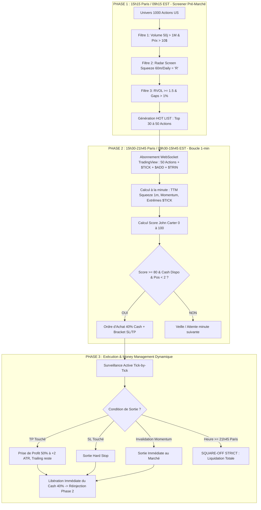

# SPÉCIFICATIONS TECHNIQUES DÉTAILLÉES DE L'ALGORITHME INTRADAY
## Méthodologie John Carter (*Mastering the Trade*) — 1000 Actions US

---

## 1. ARCHITECTURE GLOBALE EN 3 PHASES

L'architecture résout la contrainte de passage à l'échelle (1000 actions) sans blocage API par un pipeline séquentiel :

---

## 2. CARTOGRAPHIE DÉTAILLÉE DES MÉTRIQUES (OÙ ET COMMENT LES RÉCUPÉRER)

Chaque métrique utilisée dans le système est répertoriée ci-dessous avec sa formule, son fournisseur de données et sa source exacte.

| Métrique | Utilité Algorithmique | Source de Données | Symbole / Endpoint | Résolution / Période | Formule Mathématique / Paramétrage |
| :--- | :--- | :--- | :--- | :--- | :--- |
| **Volume Quotidien Moyen (50j)** | Élimination des actions illiquides | **Yahoo Finance** | `{TICKER}` (ex: `AAPL`, `NVDA`) | Daily (50 bars) | $\text{SMA}(\text{Volume}, 50) \ge 1\ 000\ 000$ |
| **Prix Spot / Close Quotidien** | Élimination des Penny Stocks | **Yahoo Finance** | `{TICKER}` | Daily (1 bar) | $\text{Close} \ge 10.00\text{ \$}$ |
| **Volume Relatif (RVOL)** | Détection de l'activité institutionnelle (*Full Tank of Gas*) | **Yahoo Finance** & **TradingView WS** | `{TICKER}` | 1m / Quotidien | $\text{RVOL} = \frac{\text{Volume Cumulé Intraday}}{\text{Volume Moyen Historique au même moment}} \ge 1.5$ |
| **Gap Pré-Marché (%)** | Détection des catalyseurs de rupture | **Yahoo Finance** | `{TICKER}` | Pre-market Quote | $\text{Gap} = \frac{\text{Prix Pré-Marché} - \text{Close Veille}}{\text{Close Veille}} \times 100$ |
| **Squeeze Anchor (Daily / 60m)** | Filtre de direction macro (*Red Dot Mode*) | **TradingView WS** (`tvdatafeedclient-js`) | `NASDAQ:{TICKER}` / `NYSE:{TICKER}` | 60 min & Daily (50 bars) | Bandes Bollinger $(20, 2.0)$ < Canaux Keltner $(20, 1.5\text{ ATR})$ |
| **Squeeze Intraday (1m)** | Timing d'entrée précis (*Squeeze Firing*) | **TradingView WS** (`tvdatafeedclient-js`) | `NASDAQ:{TICKER}` / `NYSE:{TICKER}` | 1 min (50 bars) | Déclenchement : BB sort de KC + Momentum vert/rouge |
| **Histogramme Momentum TTM** | Direction et accélération du mouvement | **TradingView WS** (`tvdatafeedclient-js`) | `{TICKER}` | 1 min & 60 min | Régression linéaire de $( \text{Prix} - \text{Moyenne}(\text{Donchian, SMA20}) )$ |
| **NYSE $TICK** | Pression d'exécution institutionnelle en direct | **TradingView WS** (`tvdatafeedclient-js`) | `USI:TICK` | 1 min (20 bars) | Extrêmes à $\ge +1000$ (Short Fade) ou $\le -1000$ (Long Fade) |
| **NASDAQ $TICK** | Confirmation sur les valeurs technologiques | **TradingView WS** (`tvdatafeedclient-js`) | `USI:TICKQ` | 1 min (20 bars) | Extrêmes à $\ge +1000$ ou $\le -1000$ |
| **Advance/Decline ($ADD)** | Filtre de régime : Marché en Range vs Trend Day | **TradingView WS** (`tvdatafeedclient-js`) | `USI:ADD` | 1 min (20 bars) | Si $\|ADD\| > 1500 \rightarrow$ Journée Directionnelle (Interdiction de Fade) |
| **Arm's Index ($TRIN)** | Confirmation de volume acheteur vs vendeur | **TradingView WS** (`tvdatafeedclient-js`) | `USI:TRIN` | 1 min (20 bars) | $TRIN < 0.8$ (Pression acheteuse forte), $TRIN > 1.2$ (Pression vendeuse) |
| **Average True Range (ATR)** | Calcul dynamique du Stop-Loss et Take-Profit | **TradingView WS** | `{TICKER}` | 1 min (14 bars) | $\text{ATR}(14) = \text{SMA}(\text{True Range}, 14)$ |

---

## 3. DÉROULEMENT OPÉRATIONNEL ÉTAPE PAR ÉTAPE

### PHASE 1 : GÉNÉRATION DU RADAR SCREEN (15h15 Paris / 09h15 EST)
*Objectif : Réduire 1000 actions à 30-50 actions hautement prioritaires.*

1. **Extraction de masse (Yahoo Finance Batch) :**
   - Récupération des prix pré-marché, volumes moyens 50 jours et close veille des 1000 tickers.
2. **Filtrage de premier niveau (Statique) :**
   - $\text{Prix} \ge 10.00\text{ \$}$
   - $\text{Volume Moyen 50j} \ge 1\ 000\ 000\text{ actions}$
   - Élimination immédiate des $\approx 700$ actions non qualifiées.
3. **Filtrage dynamique (TradingView WS - 60 min & Daily) :**
   - Pour les 300 actions restantes : calcul de l'état TTM Squeeze sur les unités de temps 60m et Daily.
   - Classification : `R` (*Red Dot* = en compression), `B` (*Buy* = Squeeze haussier déclenché), `S` (*Sell* = Squeeze baissier).
4. **Classement & Sortie Hot List :**
   - Sélection des **Top 30 à 50 actions** affichant le statut `R` en 60m/Daily combiné à un $\text{RVOL} \ge 1.5$ ou un $\text{Gap} \ge 1\%$.

---

### PHASE 2 : EXÉCUTION & SCORING TEMPS RÉEL (15h30 à 21h45 Paris)
*Objectif : Scanner chaque minute les 50 actions de la Hot List + les 4 indices de marché.*

À chaque minute $T$ :

#### 1. Synchronisation des Données
- Récupérer la dernière bougie 1m terminée des 50 actions de la Hot List.
- Récupérer les valeurs instantanées de `USI:TICK`, `USI:ADD`, `USI:TRIN` et `SPY`.

#### 2. Calcul du Score Carter (0 à 100)
Pour chaque action de la Hot List :

$$\text{Score} = S_{\text{Squeeze 1m}} + S_{\text{Anchor 60m}} + S_{\text{RVOL}} + S_{\text{Market Breadth}}$$

- **$S_{\text{Squeeze 1m}}$ (35 pts) :**
  - Bandes BB20 à l'intérieur de KC20 : **+20 pts**
  - Sortie de compression (*Squeeze Fired*) sur la bougie courante : **+15 pts**
- **$S_{\text{Anchor 60m}}$ (25 pts) :**
  - Alignement de la tendance 60-min (EMA 8 > EMA 21 pour Long) : **+15 pts**
  - Momentum 60-min de même signe que le signal 1m : **+10 pts**
- **$S_{\text{RVOL}}$ (20 pts) :**
  - Volume 1m supérieur à $200\%$ du volume moyen 1m : **+20 pts**
- **$S_{\text{Market Breadth}}$ (20 pts) :**
  - $ADD$ neutre ($|ADD| < 1500$) : **+10 pts**
  - $TICK$ confirmant la direction ($TICK > 0$ pour Long, $TICK < 0$ pour Short) : **+10 pts**

---

### PHASE 3 : MONEY MANAGEMENT & GESTION DES POSITIONS

#### 1. Règles d'Entrée
- **Seuil d'entrée :** $\text{Score} \ge 80 / 100$.
- **Condition de Portefeuille :** Nombre de positions ouvertes $< 2$.
- **Taille de Position :**
  $$\text{Capital par Position} = 0.40 \times \text{Cash Disponible}$$
  $$\text{Quantité } N = \left\lfloor \frac{\text{Capital par Position}}{\text{Prix d'Entrée}} \right\rfloor$$

#### 2. Placement des Ordres Bracket (OCO)
- **Ordre d'entrée :** Ordre Limite ajustable ou Marché au déblocage du Squeeze.
- **Stop-Loss Hard ($SL$) :**
  $$SL_{\text{Long}} = \min(\text{Low}_{\text{Signal}}, KC_{\text{Lower}}) - 0.02\text{ \$}$$
  *(Si $| \text{Prix} - SL | > 2\%$ du cours, trade rejeté pour préserver le risque).*
- **Take-Profit 1 ($TP_1$) :** Vente de $50\%$ de la position à $\text{Prix d'Entrée} + 2 \times \text{ATR}(14)$.
- **Take-Profit 2 ($TP_2$) :** Suivi de tendance avec Trailing Stop basé sur l'EMA 8 / EMA 21 1m.

#### 3. Invalidation et Recyclage du Cash
- **Invalidation Technique :** Si l'histogramme de momentum TTM s'inverse (ex: passe du bleu clair au bleu foncé / rouge), sortie immédiate au marché.
- **Recyclage Immédiat :** Dès clôture d'une position, le cash ($40\% + \text{P\&L}$) redevient disponible pour le prochain scan 1-minute.

#### 4. Square-Off Strict à 21h45 Paris (15h45 EST)
- Fermeture automatique et sans exception de toutes les positions au marché.
- Annulation de tous les ordres bracket/limites en attente.
- Arrêt du moteur de trading jusqu'au lendemain.

---

## 4. VOLUME EXACT DES APPELS API

| Phase | Outil / Source | Fréquence | Requêtes / Min | Requêtes / Séance |
| :--- | :--- | :--- | :--- | :--- |
| **Phase 1 : Screener (15h15)** | Yahoo Finance (Batch) | 1 fois / jour | - | **1 000 requêtes** |
| **Phase 1 : Radar 60m (15h20)** | TradingView WS | 1 fois / jour | - | **300 requêtes** |
| **Phase 2 : Scan Intraday (15h30-21h45)** | TradingView WS (50 Hot + 4 Index) | Chaque minute ($375\text{ min}$) | **54 req/min** | **20 250 lectures** |
| **Phase 3 : Positions Actives (2 max)** | Broker API (IBKR / Tradier) | Temps réel WebSocket | Streaming | 0 polling |
| **TOTAL GÉNÉRAL** | - | - | **~54 req/min** | **~21 550 req/jour** |

> ✅ **Conclusion de faisabilité :** Avec une moyenne de **54 lectures de bougies par minute**, le système s'exécute de manière ultra-fluide sur une seule connexion WebSocket TradingView sans risque de surcharge ni de bannissement IP.
